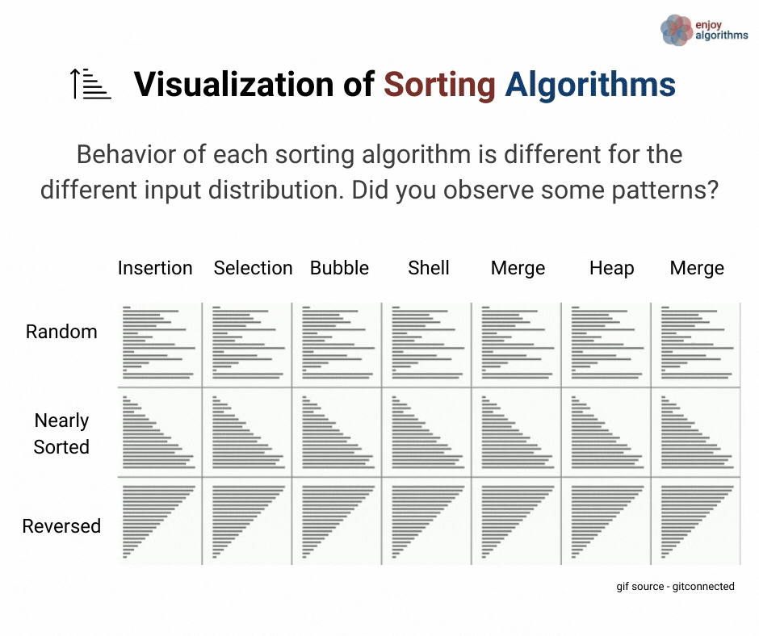
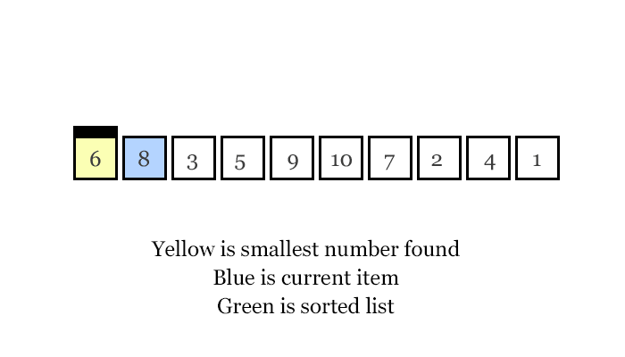
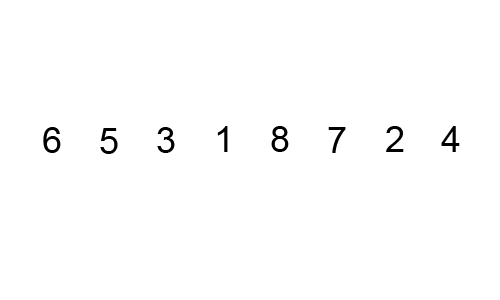
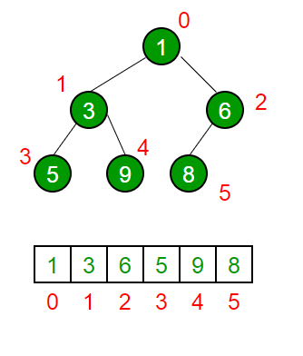

```
> #h1
> #h2
> ...
> *in đậm*
> **bôi đậm*
> ***in nghiêng và bôi đậm***
> `thêm code`
> [title](link//anh)
> gạch đầu dòng:
	> *
	> *
	> *
	> hoặc
	> 1.
	> 2.
	> 3.
> gạch kẻ ***
> highlight text >
> \
> {@youtube: Youtube ID or url}
```

## Các lý thuyết tổng hợp

**Độ phức tạp** là gì?
> Độ phức tạp thuật toán là định lượng tương đối thể hiện **số phép toán** của giải thuật so với kích thước của đầu vào.

**Độ ổn định(stable)** là gì?
> Độ ổn định của thuật toán là **đảm bảo thứ tự ban đầu** của dữ liệu đầu vào sau khi sắp xếp


Phân loại dựa trên **phương pháp**

* Cách tiếp cận ***chia để trị***: merge sort và quicksort
* Cách tiếp cận gia tăng việc sử dụng các ***vòng lặp lồng nhau***:  bucket sort, selection sort, insertion sort.
* Giải quyết vấn đề bằng cách sử dụng ***cấu trúc dữ liệu***: heapsort, tree sort
* Giải quyết vấn đề bằng cách sử dụng ***băm***: counting sort



***
## Giải thuật sắp xếp selectionsort
#### 1. Lý thuyết
> **Sắp xếp chọn** được tiến hành bằng cách **chia mảng thành hai phần**, **được sắp xếp** ở phía bên phải, và **chưa được sắp xếp** ở phía bên trái. 

> Sau mỗi lần chạy, **phần tử lớn nhất(hoặc bé nhất)** luôn **được đẩy về phía mảng đã sắp xếp**

#### 2. Minh họa

#### 3. Độ phức tạp
> Độ phức tạp thời gian của trường hợp **xấu nhất, trung bình và tốt nhất** đều là: **O (n * n)**. Vì giải thuật **luôn thực hiện quá trình lặp 2 mảng**.
#### 4. Code
```
* Thực hiện một vòng lặp tới vị trí gần cuối mảng(độ dài - 1)
* Đặt giá trị index vào vị trí đầu tiên của của lần lặp
* Thực hiện một vòng lặp từ vị trí tiếp theo đến cuối mảng
* Đặt giá trị index nếu giá trị hiện tại lớn hơn giá trị tại index
* Đảo nếu vị trí index và vị trí đầu tiên của lần lặp
```
```
void selectionSort(int arr[], int n)
{
    int i, j, min_idx;
    for (i = 0; i < n-1; i++)
	    min_idx = i;
	    for (j = i+1; j < n; j++)
	        if (arr[j] < arr[min_idx])
	        min_idx = j;
		swap(arr[min_idx], arr[i]);
}
```

***

## Giải thuật sắp xếp bubblesort
#### 1. Lý thuyết
> **Sắp xếp nổi bọt** được tiến hành dựa trên việc **so sánh cặp phần tử liền kề nhau và tráo đổi thứ tự** nếu chúng không theo thứ tự.

> Sau mỗi lần chạy, **phần tử lớn nhất luôn nổi lên trên tuần tự**.

#### 2. Minh họa



#### 3. Độ phức tạp
> Độ phức tạp thời gian của trường hợp **xấu nhất và trung bình**: **O (n * n)**. Trường hợp xấu nhất xảy ra **khi mảng được sắp xếp ngược lại**.

> Độ phức tạp về thời gian của trường hợp ***tốt nhất***: **O (n)**. Trường hợp tốt nhất xảy ra **khi mảng đã được sắp xếp**.

#### 4. Code
* thuật toán cơ bản
```
* Thực hiện một vòng lặp từ đầu đến cuối mảng
* Thực hiện một vòng lặp từ đầu đến vị trí i(độ dài - số vòng lặp)
* Thực hiện đảo phần tử nếu phần tử trước lớn hơn phần tử sau
```
```
void bubbleSort(int arr[], int lengthOfArr)  
{  
    int i, j;  
    for (i = 0; i < lengthOfArr-1; i++)
	    // Last i elements are already in place  
	    for (j = 0; j < lengthOfArr-i-1; j++)  
	        if (arr[j] > arr[j+1])  
	            swap(&arr[j], &arr[j+1]);  
} 
```
* thuật toán cải tiến
> Có thêm **biến bool kiểm tra**, nếu mảng đã tối ưu và **không xảy ra sự thay đổi** nào thì trực tiếp **ngắt ngay lần chạy thứ nhất**
```
void bubbleSort(int arr[], int n) 
{ 
   int i, j; 
   bool swapped; 
   for (i = 0; i < n-1; i++){ 
     swapped = false; 
     for (j = 0; j < n-i-1; j++){ 
        if (arr[j] > arr[j+1]){ 
           swap(&arr[j], &arr[j+1]); 
           swapped = true; 
        } 
     }
     if (swapped == false) 
        break; 
   } 
}
```
## Giải thuật sắp xếp insertionsort
#### 1. Lý thuyết
> **Sắp xếp chèn** là chèn một phần tử vào danh sách con đã qua sắp xếp. Phần tử được **chèn vào vị trí thích hợp** sao cho vẫn **đảm bảo danh sách con vẫn sắp theo thứ tự**.

> Danh sách đã sắp xếp ban đầu là rỗng và **danh sách lớn dần** và **tốc độ xử lý chậm dần**

#### 2. Minh họa


#### 3. Độ phức tạp

> Độ phức tạp thời gian của trường hợp **xấu nhất, trung bình: O(n\*n)**. Trường hợp xấu nhất xảy ra khi **sắp xếp mảng ngược** và phải so sánh từng phần tử.

> Độ phức tạp về thời gian của trường hợp tốt nhất : O (n). Trường hợp tốt nhất xảy ra khi mảng đã được sắp xếp khi **phần tử được duyệt ngay lần so sánh đầu tiên**.

#### 4. Code
```
* Chọn giá trị của phần tử đầu tiên là được sắp xếp
* Duyệt mảng từ phần tử thứ hai đến cuối 
* với mỗi phần tử là khóa và lưa địa chỉ hiện tại làm điểm neo
* Duyệt mảng ngược từ điểm neo về 0
* Bất cứ phần tử nào lớn hơn khóa thì đảo vị trí của khóa và phần tử đó
```
```
void insertionSort(int arr[], int n){
   int i, key, j;
   for (i = 1; i < n; i++){
       key = arr[i];
       j = i-1;
       while (j >= 0 && arr[j] > key){
           arr[j+1] = arr[j];
           j = j-1;
       }
       arr[j+1] = key;
   }
}
```
## giải thuật sắp xếp quicksort
#### 1. Lý thuyết
> **Sắp xếp quickSort** được tiến hành dựa trên **chia đôi mảng** được sắp xếp **thành mảng chỉ nhỏ và chỉ lớn hơn hoặc bằng pivot**, và **chuyển phần tử pivot về giữa** hai mảng con, **lặp lại tới khi còn một phần tử**.

> Có 4 cách chọn Pivot: **Đầu mảng, Cuối mảng, Trung vị**(Giữa mảng), và random(Tuy nhiên rất dễ rơi vào trường hợp đặc biệt: Luôn là số lớn nhất, Bé nhất,...).

> **Nhanh** hơn bắt kì thuật toán sắp xếp nào, tuy nhiên **nhược điểm là vị trí các phần tử tương tự nhau có thể bị thay đổi**.

#### 2. Minh họa


#### 3. Độ phức tạp
> Độ phức tạp thời gian của trường hợp **tốt nhất, trung bình: O(nlog(n))**. Trường hợp này khó xác định, phụ thuộc hoàn toàn vào pivot

> Độ phức tạp thời gian của trường hợp **xấu nhất: O(n^2)**. Trường hợp xảy ra khi **mảng chứa các phần tử giống nhau**, hoặc là **mảng ngược**.

#### 4. Lựa chọn pivot: code và mã giả
> Các mảng được **chia nhỏ và xếp lại dựa vào đệ quy**, việc **đánh True chỉ giúp dễ quan sát các vị trí đã được sắp xếp đúng**, và các **mảng con là các mảng được ngăn cách bởi True**.

* Pivot là phần tử đầu: cần low
```
> Bước 1: Lấy phần tử đầu danh sách làm chốt.
> Bước 2: Phần còn lại không bao gồm chốt là mảng cần chia.
> Bước 3: Nếu có phần tử lớn hơn chốt đầu tiên từ trái đếm qua, thì đánh dấu đó là left và thoát
> Bước 4: Nếu có phần tử nhỏ hơn chốt đầu tiên từ phải đếm qua, thì đánh dấu đó là right và thoát
> Bước 5: Nếu left nhỏ hơn right thì đổi vị trí left và right, tiếp tục bước 3 bước 4 bỏ qua phần tử tại vị trí left và right
> Bước 6: Nếu left lớn hơn right thì đổi vị trí của chốt và right
```
```
arr[] = {10, 80, 30, 90, 40}
Indexes:  0   1   2   3   4
pivot = 10, left = 1, right = 4, low = 0 
left = 1 <= right = 4 nhưng arr[left = 1] = 80 > pivot = 10 => ngắt
right = 4 >= left = 1 và arr[right = 4] = 40 > pivot = 10
...
right = 1 >= left = 1 và arr[right = 1] = 40 >= pivot = 10 
right = 0 < left = 1 => ngắt  
vì left = 1 > right = 0: đổi vị trí arr[right]<=>arr[low = 0] và đánh True

arr[] = {10, 80, 30, 90, 40}
Indexes:  True   1   2   3   4
pivot = 80, left = 2, right = 4, low = 1
left = 2 <= right = 4 và arr[left = 2] = 30 < pivot = 80 
left = 3 <= right = 4 nhưng arr[left = 3] = 90 > pivot = 80 => ngắt
right = 4 >= left = 3 nhưng arr[right = 4] = 40 < pivot = 80 => ngắt
Vì left = 3  < right = 4: đổi vị trí arr[right]<=>arr[left]
=> arr[] = {10, 80, 30, 40, 90}
left = 4 <= right = 4 nhưng arr[left = 4] = 90 == pivot = 90 => ngắt
right = 4 >= left = 4 và arr[right = 4] = 90 >= pivot = 90
right = 3 < left = 4 => ngắt
vì left = 4 > right = 3: đổi vị trí arr[right = 3]<=>arr[low = 1] và đánh True

arr[] = {10, 40, 30, 80, 90}
Indexes:  True   1   2   True   4
pivot = 40, left = 2, right = 2, low = 1
left = 2 <= right = 2 và arr[left = 2] = 30 < pivot = 40
left = 3 > right = 2 => ngắt
right = 2 < left = 3 => ngắt
Vì left = 3 > right = 2: đổi vị trí arr[right]<=>arr[low = 1] và đánh True
=> arr[] = {10, 30, 40, 80, 90}
pivot = 90, left = 5, right = 4, low = 4
left = 5 > right = 4 => ngắt
right = 4 < left = 5 => ngắt
Vì left = 5 > right = 4: đổi vị trí arr[right]<=>arr[low] và đánh True

arr[] = {10, 40, 30, 80, 90}
Indexes:  True   True   2   True   True
pivot = 30, left = 3, right = 2, low = 2
left = 3 > right = 2 => ngắt
right = 2 < left = 2 => ngắt
Vì left = 3 > right = 2: đổi vị trí arr[right]<=>arr[low] và đánh True

arr[] = {10, 40, 30, 80, 90}
Indexes:  True   True   True   True   True
```
```
int leftPartition (int arr[], int low, int high)
{
    int pivot = arr[low];    // pivot
    int left = low + 1;
    int right = high;
    while(true){
        while(left <= right && arr[left] < pivot) left++; // Tìm phần tử >= arr[pivot]
        while(right >= left && arr[right] > pivot) right--; // Tìm phần tử <= arr[pivot]
        if (left >= right) break; // Đã duyệt xong thì thoát vòng lặp
        swap(&arr[left], &arr[right]); // Nếu chưa xong, đổi chỗ.
        left++; // Vì left hiện tại đã xét, nên cần tăng
        right--; // Vì right hiện tại đã xét, nên cần giảm
    }
    swap(&arr[right], &arr[low]);
    return right; // Trả về chỉ số nằm giữa hai mảng con sẽ dùng để chia đổi mảng
}
```

* Pivot là phần tử cuối: cần high
```
> Bước 1: Lấy phần tử cuối danh sách làm chốt.
> Bước 2: Phần còn lại không bao gồm chốt là mảng cần chia.
> Bước 3: Nếu có phần tử lớn hơn chốt đầu tiên từ trái đếm qua, thì đánh dấu đó là left và thoát.
> Bước 4: Nếu có phần tử nhỏ hơn chốt đầu tiên từ phải đếm qua, thì đánh dấu đó là right và thoát.
> Bước 5: Nếu left nhỏ hơn right thì đổi vị trí left và right, tiếp tục bước 3 bước 4 bỏ qua vị trí left và right.
> Bước 6: Nếu left lớn hơn right thì đổi vị trí của chốt và left.
```
```
arr[] = {10, 80, 30, 90, 40}
Indexes:  0   1   2   3   4
pivot = 40, left = 0, right = 3, high = 4
left = 0 <= right = 4 và arr[left = 0] = 10 < pivot = 40 
left = 1 <= right = 4 nhưng arr[left = 1] = 80 < pivot = 40 => ngắt
right = 3 >= left = 1 và arr[right = 3] = 90 > pivot = 40
right = 2 >= left = 1 và arr[right = 2] = 30 < pivot = 40 => ngắt
Vì left = 1 > right = 2: đổi vị trí arr[right]<=>arr[left] 
=> arr[] = {10, 30, 80, 90, 40} 
left = 2 <= right = 2 và arr[left = 2] = 30 < pivot = 40
left = 3 > right = 2 => ngắt
right = 2 < left = 3 => ngắt  
vì left = 3 > right = 2: đổi vị trí arr[left]<=>arr[high = 4] và đánh True

arr[] = {10, 30, 40, 90, 80}
Indexes:  0   1   True   3   4
pivot = 30, left = 0, right = 0, high = 1
left = 0 <= right = 0 và arr[left = 0] = 10 < pivot = 30
left = 1 > right = 0 => ngắt
right = 0 < left = 1 => ngắt
Vì left = 1 > right = 0: đổi vị trí arr[left = 1]<=>arr[high = 1] và đánh True
pivot = 80, left = 3, right = 3, high = 4
left = 3 <= right = 3 nhưng arr[left = 3] = 90 > pivot = 80 => ngắt
right = 3 >= left = 3 và arr[right = 3] = 90 > pivot = 80
right = 2 < left = 3 => ngắt
Vì left = 3 > right = 2: đổi vị trí arr[left = 3]<=>arr[high = 4] và đánh True

arr[] = {10, 30, 40, 80, 90}
Indexes:  0   True   True   True   4
pivot = 10, left = 0, right = -1, high = 0
left = 0 > right = -1 => ngắt
right = -1 < left = 0 => ngắt
Vì left = 0 > right = -1: đổi vị trí arr[left = 0]<=>arr[high = 0] và đánh True
pivot = 90, left = 4, right = 3, high = 4
left = 4 > right = 3 => ngắt
right = 3 < left = 4 => ngắt
Vì left = 4 > right = 3: đổi vị trí arr[left = 4]<=>arr[high = 4] và đánh True

arr[] = {10, 30, 40, 80, 90}
Indexes:  True   True   True   True   True
```
```
int rightPartition (int arr[], int low, int high)
{
    int pivot = arr[high];    // pivot
    int left = low;
    int right = high - 1;
    while(true){
        while(left <= right && arr[left] < pivot) left++; // Tìm phần tử >= arr[pivot]
        while(right >= left && arr[right] > pivot) right--; // Tìm phần tử <= arr[pivot]
        if (left >= right) break; // Đã duyệt xong thì thoát vòng lặp
        swap(&arr[left], &arr[right]); // Nếu chưa xong, đổi chỗ.
        left++; // Vì left hiện tại đã xét, nên cần tăng
        right--; // Vì right hiện tại đã xét, nên cần giảm
    }
    swap(&arr[left], &arr[high]);
    return left; // Trả về chỉ số nằm giữa hai mảng con sẽ dùng để chia đổi mảng
}
```

* Pivot là phần tử trung vị: cần left + (left + high)/2
#### 5. Code
```
int rightPartition (int arr[], int low, int high){}
int leftPartition (int arr[], int low, int high){}
void quickSort(int arr[], int low, int high)
{
    if (low < high)
    {
        int pi = leftPartition(arr, low, high);
        // int pi = rightPartition(arr, low, high);
        // Gọi đệ quy sắp xếp 2 mảng con trái và phải
        quickSort(arr, low, pi - 1);
        quickSort(arr, pi + 1, high);
    }
}
```
## giải thuật sắp xếp heapsort 
#### 1. Lý thuyết

> **Thuật toán heapSort** được tiến hành dựa trên **xây dựng một cây nhị phân ảo**, nơi mà các **phần tử phía trên luôn lớn hơn các phần tử phía dưới**. Phần tử **trên cùng là lớn nhất**. Sau đó, **đảo với phần tử cuối cùng và loại bỏ nó** ra khỏi cây, lặp lại cho đến khi cây kết thúc.

> Đó là **max heap**. Ngoài ra còn có **min heap**, nơi mà **các phần tử nhỏ hơn được xếp trên**.


#### 2. Minh họa

#### 3. Độ phức tạp

> Độ phức tạp thời gian của trường hợp **tốt nhất, trung bình, xấu nhất**: **O(Log(n))**. 

> Độ phức tạp thời gian của **tạo cây nhị phân ảo** là **O(n)**

> Độ phức tạp thời gian **tổng thể của Heap Sort**: **O(nlog(n))**.

#### 4. Tạo cây

* Vị trí phần tử trong cây

> Giả định phần tử **i là cha**, thì phần tử **con bên trái là (i*2 + 1)** và **(i*2 + 2) là phần tử bên phải**.



* Sắp xếp vị trí cây
```
> Xác định các vị trí cây.
> Mặc định phần tử cha là phần tử lớn nhất.
> Nếu có phần tử con lớn hơn phần tử cha, thì đảo vị trí với cha và đi sâu vào nhánh con của cây đã thay đổi.
> Lặp lại quá trình đi sâu cho đến khi cây được sắp xếp.
```
> **Đây là maxHeap**, đối với **minHeap thì phần tử cha là phần tử nhỏ nhất**.

> Vì là **nhị phân nên chỉ cần đi sau vào phần tử bị thay đổi**.

```
void maxHeapify(int arr[], int n, int i) 
{ 
    int largest = i; // Xác định vị trí cha 
    int l = 2*i + 1; // Xác định vị trí con trái
    int r = 2*i + 2; // Xác định vị trí con phải
    // Kiểm tra vị trí cây hiện tại 
    if (l < n && arr[l] > arr[largest]) 
        largest = l;   
    if (r < n && arr[r] > arr[largest]) 
        largest = r;   
    // Nếu có sự thay đổi thì:
    if (largest != i) 
    {
    	// Đảo vị trí phần tử lớn nhất lên đầu
        swap(arr[i], arr[largest]);
        // Đi sâu vào cây con    
        maxHeapify(arr, n, largest); 
    } 
} 
```
```
void minHeapify(int arr[], int n, int i) 
{ 
    int smallest = i; // Xác định vị trí cha 
    int l = 2*i + 1; // Xác định vị trí con trái
    int r = 2*i + 2; // Xác định vị trí con phải
    // Kiểm tra vị trí cây hiện tại 
    if (l < n && arr[l] < arr[smallest]) 
        smallest = l;   
    if (r < n && arr[r] < arr[smallest]) 
        smallest = r;   
    // Nếu có sự thay đổi thì:
    if (smallest != i) 
    {
    	// Đảo vị trí phần tử lớn nhất lên đầu
        swap(arr[i], arr[smallest]);
        // Đi sâu vào cây con    
        minHeapify(arr, n, smallest); 
    } 
}
```

#### 5. Code

```
> Bước 1: Tạo cây
> Bước 2: Đảo vị trí phần tử lớn nhất(nhỏ nhất) về cuối
> Bước 3: Loại bỏ phần tử cuối và lặp lại quá trình
```
```
void maxHeapify(int arr[], int n, int i){}
void minHeapify(int arr[], int n, int i){}
void heapSort(int arr[], int n) 
{ 
    // Xây dựng cây ban đầu
    for (int i = n / 2 - 1; i >= 0; i--) 
        maxHeapify(arr, n, i);   
    // Bắt đầu quá trình sắp xếp 
    for (int i=n-1; i>0; i--) 
    { 
        Loại bỏ phần tử cuối 
        swap(arr[0], arr[i]);  
        // Lặp lại quá trình 
        maxHeapify(arr, i, 0); 
    } 
}
```

## giải thuật sắp xếp trộn merge sort
#### 1. Lý thuyết

> **Sắp xếp trộn** được tiến hành dựa trên **chia nhỏ danh sách** cần sắp xếp **thành từng phần tử theo nguyên tắc** rồi sau đó **hòa nhập theo phương pháp trộn** tự nhiên thành dãy có thứ tự.

> Phù hợp với các bài toán có **dữ liệu lớn và phức tạp**. 

> **Phương pháp trộn phần tử** luôn **đảm bảo chuỗi con là một dãy tăng(giảm)**, sau đó **so sánh các phần tử đầu** để ghép vào chuỗi lớn hơn. Nếu chuỗi con này **rỗng thì lấy toàn bộ chuỗi kia**.

#### 2. Minh họa


#### 3. Độ phức tạp

> Độ phức tạp thời gian của trường hợp xấu nhất, trung bình, tốt nhất: O(nlog(n)). 

> Các phần tử luôn trải qua quá trình tách và ghép phần tử, tuy nhanh nhưng nhược điểm là thuật toán khó cài đặt

#### 4. Minh họa thuật toán trộn và code
```
Giả sử ta có 2 mảng con lần lượt là:
arr1[n1 = 4] = [1, 9, 10, 10] 
arr2[n2 = 4] = [3, 5, 7, 9]
sort_arr = []
Khởi tạo i = 0, j = 0 tương ứng là chỉ số bắt đầu của arr1 và arr2
nếu arr1[i] =< arr2[j]:
chèn arr1[i] vào đầu sort_arr và i+=1
nếu arr1[i] > arr2[j]:
chèn arr2[j] vào đầu sort_arr và j+=1
nếu i == n1 (tương ứng arr1 xếp xong)
chèn arr1[j] còn lại vào sort_arr, kết thúc quá trình xếp
nếu j == n2 (tương ứng arr2 xếp xong)
chèn arr2[i] còn lại vào sort_arr, kết thúc quá trình xếp
```
```
// Gộp hai mảng con arr[l...m] và arr[m+1..r]
void merge(int arr[], int l, int m, int r)
{
    int i, j, k;
    int n1 = m - l + 1;
    int n2 =  r - m;
    /* Tạo các mảng tạm */
    int L[n1], R[n2]; 
    /* Copy dữ liệu sang các mảng tạm */
    for (i = 0; i < n1; i++)
        L[i] = arr[l + i];
    for (j = 0; j < n2; j++)
        R[j] = arr[m + 1+ j]; 
    /* Gộp hai mảng tạm vừa rồi vào mảng arr*/
    i = 0; // Khởi tạo chỉ số bắt đầu của mảng con đầu tiên
    j = 0; // Khởi tạo chỉ số bắt đầu của mảng con thứ hai
    k = l; // Khởi tạo chỉ số bắt đầu của mảng lưu kết quả
    while (i < n1 && j < n2){
        if (L[i] <= R[j]){
            arr[k] = L[i];
            i++;
        }
        else{
            arr[k] = R[j];
            j++;
        }
        k++;
    }
    /* Copy các phần tử còn lại của mảng L vào arr nếu có */
    while (i < n1)
    {
        arr[k] = L[i];
        i++;
        k++;
    }
    /* Copy các phần tử còn lại của mảng R vào arr nếu có */
    while (j < n2)
    {
        arr[k] = R[j];
        j++;
        k++;
    }
}
```
#### 5. Code
```
void merge(int arr[], int l, int m, int r){}
void mergeSort(int arr[], int l, int r){
    if (l < r)    {
        // Tương tự (l+r)/2, nhưng cách này tránh tràn số khi l và r lớn
        int m = l+(r-l)/2;
        // Gọi hàm đệ quy tiếp tục chia đôi từng nửa mảng
        mergeSort(arr, l, m);
        mergeSort(arr, m+1, r);
        // Hàm đệ quy tương tự để ghép từng nửa mảng
        merge(arr, l, m, r);
    }
}
```
## Tìm kiếm tuần tự, tìm kiếm nhị phân
### Tìm kiếm tuần tự
#### Lý thuyết
> **Tìm kiếm tuần tự** là lần lượt **duyệt từng phần tử** của danh sách đó **cho đến lúc tìm thấy giá trị** mong muốn **hay duyệt qua toàn bộ** danh sách và trả về rỗng.
#### Các phương pháp lặp
* Lặp tự nhiên
```
> Duyệt từng phần tử.
> Nếu Tìm được thì dừng quá trình tìm kiếm.
```
```
void sequentialSearch(int arr[], int n, int numberForFind){
	for(int i =0; i<=n; i++){
		if(arr[i] == arr[numberForFind])
			return i;
	}
	return -1;
}
```
* Lặp đệ quy
```
void sequentialSearch(int arr[], int n, int numberForFind){
	if(arr[n-1] == numberForFind)
		return n-1;
	if(n == 0)
		return -1
	return sequentialSearch(arr, n - 1, numberForFind);
}
```
* Phương pháp cải tiến
```
> Thêm phần tử cần tìm vào cuối.
> Tìm kiếm bình thường.
> Tìm được phần tử là phần tử cuối thì trả về -1
```

> Ý nghĩa: Có thể **giới hạn phạm vi tìm kiếm**.

```
void sequentialSearch(int arr[], int n, int numberForFind){
	int i=0; a[n]=x; //a[n] là phần tử “lính canh”
	while(a[i]!=x){
		i++;
	}
	if(i==n){
		return -1; //Tìm không thấy x
	}
	else{
		return i; //Tìm thấy x
	}
}
```
### Tìm kiếm nhị phân
#### Lý thuyết
> Tìm kiếm tuần tự được áp dụng với mảng đã sắp xếp. Được tiến hành dựa trên liên tục thu hẹp phạm vi tìm kiếm cho đến khi tìm được


#### Code
```
int binarySearch(int arr[], int l, int r, int x) {
  if (r >= l) {
    int mid = l + (r - l) / 2; // Tương đương (l+r)/2 nhưng ưu điểm tránh tràn số khi l,r lớn 
    // Nếu arr[mid] = x, trả về chỉ số và kết thúc.
    if (arr[mid] == x)
      return mid; 
    // Nếu arr[mid] > x, thực hiện tìm kiếm nửa trái của mảng
    if (arr[mid] > x)
      return binarySearch(arr, l, mid - 1, x); 
    // Nếu arr[mid] < x, thực hiện tìm kiếm nửa phải của mảng
    return binarySearch(arr, mid + 1, r, x);
  } 
  // Nếu không tìm thấy
  return -1;
}
```
## cây nhị phân tìm kiếm
#### 1. Lý thuyết
#### 2. Minh họa
#### 3. Độ phức tạp
#### 4. Code

***
## Đọc thêm
***
## cấu trúc dữ liệu biểu diễn danh sách(ngăn xoếp và hàng đợi)
#### 1. Lý thuyết
#### 2. Minh họa
#### 3. Độ phức tạp
#### 4. Code
## cây nhị phân và ứng dụng
#### 1. Lý thuyết
#### 2. Minh họa
#### 3. Độ phức tạp
#### 4. Code
## giải thuật sắp xếp shellsort
#### 1. Lý thuyết
#### 2. Minh họa
#### 3. Độ phức tạp
#### 4. Code
## giải thuật sắp xếp bằng cơ chế radix sort
#### 1. Lý thuyết
#### 2. Minh họa
#### 3. Độ phức tạp
#### 4. Code
## cây tìm kiếm cơ số radix search tree
#### 1. Lý thuyết
#### 2. Minh họa
#### 3. Độ phức tạp
#### 4. Code
## cây tìm kiếm số học digtal search tree
#### 1. Lý thuyết
#### 2. Minh họa
#### 3. Độ phức tạp
#### 4. Code
